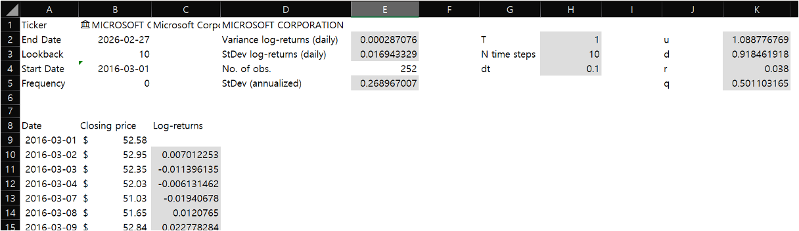
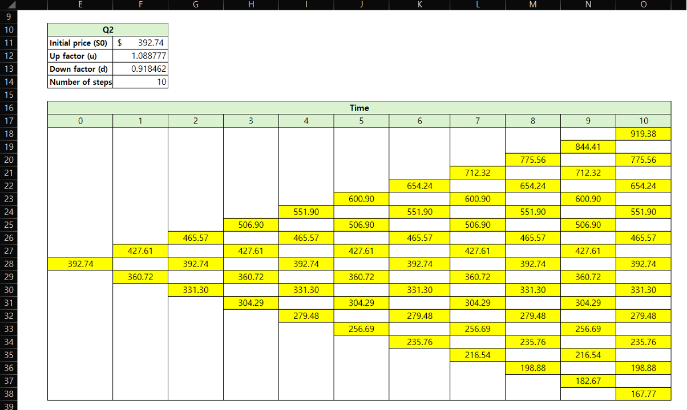
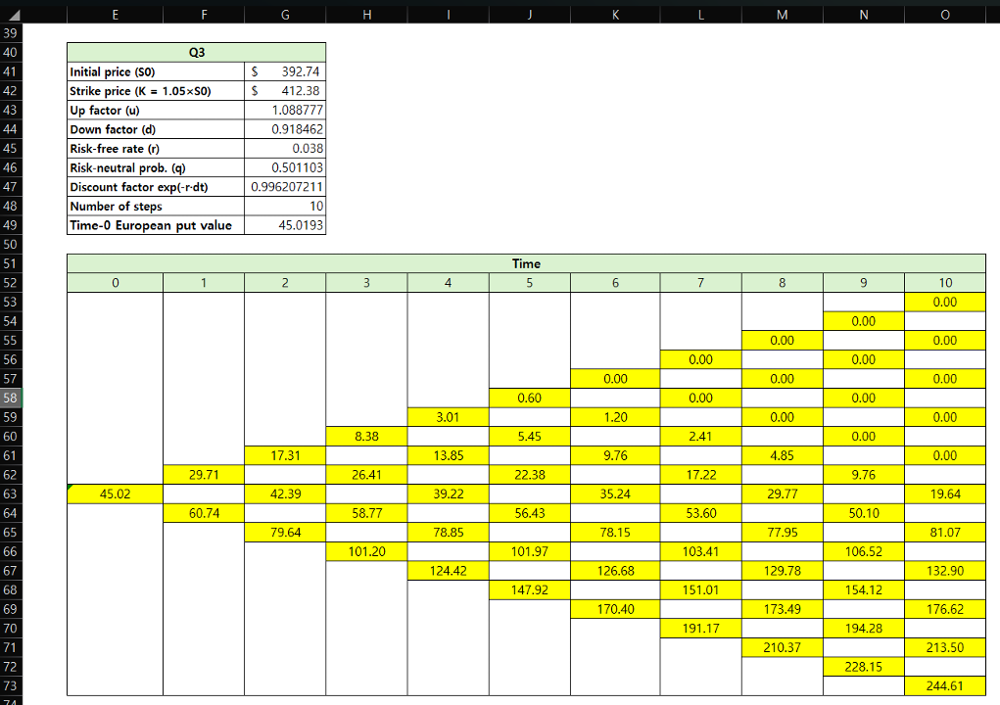
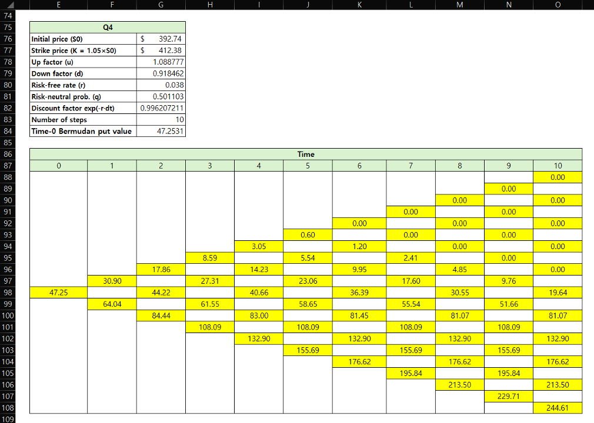
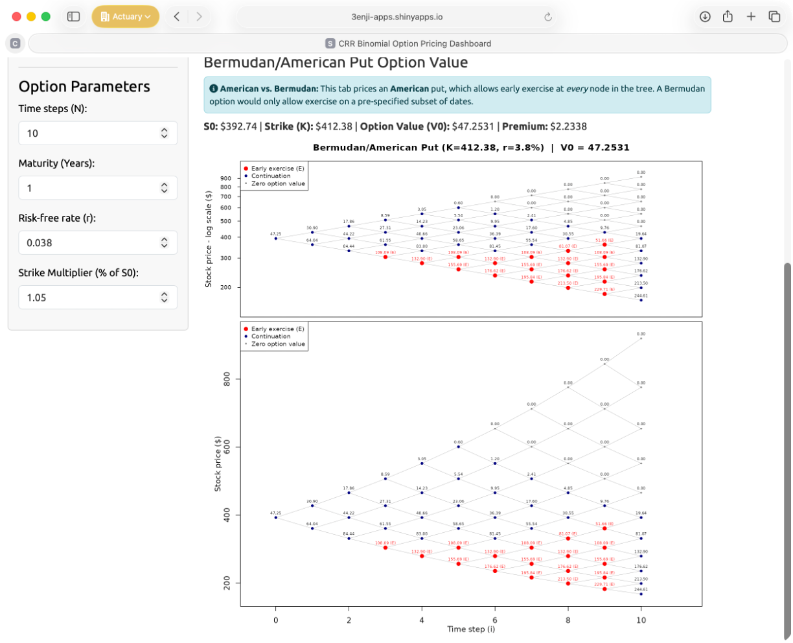

---
title:
  "Binomial Tree Calibration and European & Bermudan Put Option Valuation for
  Microsoft Corporation (MSFT) Stock"
subtitle: "SMM068 (2025-26) Group Coursework 02 - Group 03"
author:
  - "Benjamin Evans"
  - "Basmah Khan"
  - "Bong Su Kil"
  - "Ardi Wira Sudarmo"
date: "`r format(Sys.Date(), '%d %B %Y')`"
output:
  bookdown::html_document2:
    self_contained: true
    css: style.css
    toc: true
    toc_float: true
    toc_depth: 3
    number_sections: true
    code_folding: hide
    theme: united
    highlight: tango
    df_print: paged
  # runtime: shiny
  bookdown::pdf_document2:
    includes:
      in_header: preamble.tex
    pandoc_args:
      - "--lua-filter=answer.lua"
    number_sections: true
    toc: true
    latex_engine: xelatex
    citation_package: natbib
    keep_tex: true
# fontsize: 10pt
bibliography: references.bib
---

```{=latex}
\newpage
```

```{=html}
<h1>Information</h1>

This R Markdown document was created as part of a group assignment for SMM068 at Bayes Business School, City St George's, University of London in Term 2 2025-26.

```

```{r asthetic-header, include=FALSE, echo=FALSE}
# ============================================================================ #
# Key Information ====
# SMM068 Financial Economics (Subject CM2)
# Group Coursework 2025-26
# Group:        Group 08
# Authors (in alphabetical order):
#   - Benjamin Evans
#   - Basmah Khan
#   - Bong Su Kil
#   - Ardi Wira Sudarmo
# Professor:    Professor Ioannis Kyriakou
# Institution:  Bayes Business School - City St George's, University of London
# Date:         30 Mar 2026
#
# Description:  Term 2 group project for SMM068 Financial Economics
#               (50% of coursework grade - 10% of module grade). The R code
#               below has been exported directly from an R Markdown (.rmd) file.
#               Hence the knitr settings.
#
# Dependencies:
#   - quantmod: for downloading
#   - tidyverse: loads dplyr, tidyr, ggplot2, purrr (& others)
#   - TBI: loads dplyr, tidyr, ggplot2, purrr (& others)
#
# Acknowledgements
#   - Bodie et al., 2024, chapters 5-8 were used as a primary source for the
#     concepts coded here (in addition to the lecture notes)
# ============================================================================ #
```

```{r setup-knitr, include=FALSE, echo=FALSE}
# Setup & configuration ====
#----------------------- Initial setup (knitr settings) -----------------------#
dir.create("fig", showWarnings = FALSE)

# Defaults common to all outputs
knitr::opts_chunk$set(
  echo     = TRUE,
  message  = FALSE,
  warning  = FALSE,
  fig.align = "center",
  out.width = "100%",
  fig.path  = "fig/",
  dpi       = 300
)

# Output-specific settings
if (knitr::is_latex_output()) {
  knitr::opts_chunk$set(
    fig.width = 6,
    fig.height = 4,
    dev = "pdf",
    fig.pos = "!ht",
    out.extra = ""
  )
} else {
  knitr::opts_chunk$set(
    fig.width = 6,
    fig.height = 4,
    dev = "svglite"  # or "png"
  )
}

# for excel code chunks
.default_source_hook <<- knitr::knit_hooks$get("source")

knitr::knit_hooks$set(source = function(x, options) {
  if (!is.null(options$lang)) {
    if (knitr::is_latex_output()) {
      paste0("\\begin{lstlisting}[language=", options$lang, "]\n",
             paste(x, collapse = "\n"),
             "\n\\end{lstlisting}")
    } else {
      paste0('<pre class="', options$lang, '-code"><code>',
             paste(x, collapse = "\n"),
             '</code></pre>')
    }
  } else {
    .default_source_hook(x, options)
  }
})
```

```{r setup-qol, include=FALSE, echo=FALSE}
#----------------------------- Clean environment ------------------------------#
rm(list = ls()) # Remove all objects
graphics.off() # Close all graphical devices
cat("\014") # Clean console
```

```{r load-dependencies, include=FALSE, echo=FALSE}
#------------------- Load dependencies / external libraries -------------------#
# --- Data Manipulation & Plotting ---
library(tidyverse) # loads dplyr, tidyr, ggplot2, purrr (& others)
library(patchwork) # for combining multiple plots into one figure
library(readxl)    # for reading Excel workbook

# --- Reporting & Tables ---
library(kableExtra) # for general tables
library(DT) # for HTML interactive data tables
library(plotly) # for interactive html plots
library(pander) # for writing to pandoc
```


```{r custom-functions, include=FALSE, echo=FALSE}
#---------------------------- Custom QOL functions ----------------------------#
#####################################
# function: banner comments (used to to section up code)
# Usage: banner_comment("Element 1: data cleaning") -> then ctrl + v (or cmd+v)
#####################################
banner_comment <- function(text, width = 80, border = "#", fill = "-") {
  txt <- paste0(" ", text, " ")
  inner_width <- width - 2 * nchar(border)
  banner_string <- ""

  if (inner_width <= nchar(txt)) {
    banner_string <- paste0(border, txt, border)
  } else {
    pad_total <- inner_width - nchar(txt)
    pad_left <- pad_total %/% 2
    pad_right <- pad_total - pad_left

    banner_string <- paste0(
      border,
      strrep(fill, pad_left),
      txt,
      strrep(fill, pad_right),
      border
    )
  }

  cat(banner_string, "\n")
  # copy banner to allow direct pasting (requires clipr)
  clipr::write_clip(banner_string)
  # avoid [1] when printing if want to manually copy
  invisible(banner_string)
}
#####################################
# function: format p-values for text
# Usage (in-line): `r format_p_vals(ad_test_result$p.value)`
# Usage (console): format_p_vals(ad_test_result$p.value)
#####################################
format_p_vals <- function(p) {
  if (length(p) != 1L || is.na(p)) {
    stop("Error! p must be a single non-missing value")
  }
  if (p > 1) {
    stop("Error! Value greater than 1")
  }
  if (p < 0) {
    stop("Error! Value less than 0")
  }

  if (p >= 0.01) {
    paste0("= ", formatC(p, format = "f", digits = 2))
  } else if (p >= 0.001) {
    paste0("= ", formatC(p, format = "f", digits = 3))
  } else {
    "< 0.001"
  }
}
#####################################
# function: format confidence intervals for tables & text
# Usage (in-line): `r format_interval(el2_ci_normal_95[1], el2_ci_normal_95[2])`
# Usage (console): format_interval(el2_ci_normal_95[1], el2_ci_normal_95[2])
#####################################
format_interval <- function(lower, upper, digits = 3, small_interval = 5L) {
  paste0(
    "[",
    formatC(
      lower,
      format = "f",
      digits = digits,
      small.interval = small_interval,
      small.mark = " "
    ),
    ", ",
    formatC(
      upper,
      format = "f",
      digits = digits,
      small.interval = small_interval,
      small.mark = " "
    ),
    "]"
  )
}
#####################################
# function: format truncated ellipses
# Usage (in-line): `r tbi`
# Usage (console): tbi
#####################################
fmt_trunc_ellip <- function(
  x,
  digits = 7,
  ellip = "...",
  tol = 1e-12,
  trim_zeros_if_exact = TRUE
) {
  out <- rep(NA_character_, length(x))
  ok <- is.finite(x)
  scale <- 10^digits
  xt <- trunc(x[ok] * scale) / scale
  s <- formatC(xt, format = "f", digits = digits)
  add <- abs(x[ok] - xt) > tol * pmax(1, abs(x[ok]))
  if (trim_zeros_if_exact) {
    s_trim <- sub("0+$", "", s) # drop trailing zeros
    s_trim <- sub("\\.$", "", s_trim) # drop trailing decimal point
  } else {
    s_trim <- s
  }
  out[ok] <- ifelse(add, paste0(s, ellip), s_trim)
  out[is.na(x)] <- NA_character_
  out
}
#####################################
# function: function to format 6dp numbers with a space after the 3rd decimal
# digit
# Usage (in-line): TBI
# Usage (console): TBI
#####################################
format_spaced_6dp <- function(x) {
  # Format to 6 decimal places
  s <- sprintf("%.6f", x)
  # Insert space between the first 3 and last 3 decimal digits
  sub("(\\.[0-9]{3})([0-9]{3})$", "\\1 \\2", s)
}
#####################################
# function: format variable names in green in latex (& normal code in html)
# Usage (in-line): TBI `r format_var_name("dvisit")`
#####################################
format_var_name <- function(x) {
  if (knitr::is_latex_output()) {
    # replace all "_" with "\_" in va name
    paste0("\\greentt{", gsub("_", "\\\\_", x), "}")
  } else {
    # change to paste0("<code style='color:green'>", x, "</code>") for green
    # paste0("`", x, "`")
    paste0("<code style='color:green'>", x, "</code>")
  }
}
```

```{r params-setup, include=FALSE, echo=FALSE}
#------------------- Global parameters (computed from Excel data) -------------#

## Read raw price data from csv (for github upload)
price_data <- read.csv("CM2_cwk2_draft.csv", skip = 7, header = TRUE)
# Clean the dollar-formatted closing price
price_data <- price_data %>%
  select(close = Closing.price) %>%
  mutate(close = as.numeric(gsub("[$, ]", "", close))) %>%
  filter(!is.na(close))

## Compute log-returns
log_rets <- diff(log(price_data$close))
## S0: most recent closing price
S0 <- tail(price_data$close, 1)

## Daily statistics (matches Excel VAR.S / STDEV.S) 
var_daily <- var(log_rets) # var() uses n-1 denominator (= VAR.S)
std_daily <- sd(log_rets) # sd()  uses n-1 denominator (= STDEV.S)

## Annualise 
sigma <- std_daily * sqrt(252)

## Tree parameters
T_mat <- 1
N <- 10
dt <- T_mat / N

## CRR up/down factors
u <- exp(sigma * sqrt(dt))
d <- 1 / u

## Risk-neutral pricing inputs (Q3) 
r <- 0.038
K <- 1.05 * S0
q <- (exp(r * dt) - d) / (u - d)
disc <- exp(-r * dt)

## print
cat(sprintf("Prices:       %d\n", nrow(price_data)))
cat(sprintf("Log-returns:  %d\n", length(log_rets)))
cat(sprintf("S0:           %.2f\n", S0))
cat(sprintf("Var (daily):  %.15f\n", var_daily))
cat(sprintf("Std (daily):  %.15f\n", std_daily))
cat(sprintf("Sigma:        %.15f\n", sigma))
cat(sprintf("u:            %.16f\n", u))
cat(sprintf("d:            %.16f\n", d))
cat(sprintf("K:            %.4f\n", K))
cat(sprintf("q:            %.16f\n", q))
```

# Binomial model calibration ($u$ and $d$ estimation) {#qone}

_Note: For clarity of presentation, values in this report are displayed rounded
to a suitable level of precision. However, all underlying calculations were
performed using exact, unrounded figures to ensure accuracy._

The dataset contains `r format(nrow(price_data), big.mark = ",")` daily MSFT closing prices from 1 March 2016 to 27
February 2026. The most recent closing price is $S_0 = `r S0`$.

To calibrate a one-year binomial tree model, the historical daily closing prices
over the last ten years were accessed for Microsoft Corporation (MSFT) stock
from 1 March 2016 to 27 February 2026 using the Excel
`r format_var_name("STOCKHISTORY")` function. The daily log-return series was
calculated using

$$
r_{t} = \ln\left(\dfrac{S_t}{S_{t-1}}\right)
$$

This yields `r format(length(log_rets), big.mark = ",")` daily log-return observations. In Excel, this was computed in
cell C10: `r format_var_name("=LN(B10/B9)")`

From the historical log-returns, the empirical daily variance was estimated
using the sample variance function (`r format_var_name("VAR.S")`) in Excel^[The
sample variance is the appropriate metric here because our 10-year historical
dataset is a sample of Microsoft's overall price history. Applying Bessel's
correction accounts for the fact that the true population mean is unknown,
yielding an unbiased estimator of the true daily variance.]:

$$
\widehat{\text{Var}}(r_t) = `r formatC(var_daily, format = "fg", digits = 5)`
$$

This corresponds to a daily standard deviation of
$\hat{\sigma}_{\text{daily}} = `r formatC(std_daily, format = "f", digits = 6)`$.

Assuming 252 trading days per year, the annualised volatility is:

$$
\hat{\sigma}_{\text{annual}} = \hat{\sigma}_{\text{daily}} \times \sqrt{252} = `r formatC(std_daily, format = "f", digits = 6)` \times 15.875 = `r formatC(sigma, format = "f", digits = 6)`
$$

Using an assumption of ten time steps over one year:

$$
T = 1, \quad N = 10, \quad \Delta t = \frac{T}{N} = 0.1
$$

The up and down factors are defined using the Cox–Ross–Rubinstein (CRR)
specification:

$$
u = e^{\sigma \sqrt{\Delta t}} = e^{`r formatC(sigma, format="f", digits=6)` \times \sqrt{0.1}} = `r formatC(u, format="f", digits=5)`
\quad , \quad
d = \frac{1}{u} = \frac{1}{`r formatC(u, format="f", digits=5)`} = `r formatC(d, format="f", digits=5)`
$$

The recombining property $u \times d = 1$ holds exactly by construction.

<!-- prettier-ignore -->
::: {.answer-wrapper}
::: {.answer}
$u=`r formatC(u, format="f", digits=5)`, \quad d=`r formatC(d, format="f", digits=5)`$
:::
:::

These values imply that at each step of the binomial tree, the stock price
either increases by a factor of approximately
`r formatC(u, format="f", digits=5)` or decreases by a factor of approximately
`r formatC(d, format="f", digits=5)`. For completeness, using the continuously
compounded risk-free rate $r = `r r`$ as given in \@ref(qthr), the risk-neutral
probability is:

$$
q
= \frac{e^{r\Delta t} - d}{u - d}
= \frac{e^{`r r` \times 0.1} - (`r formatC(d, format="f", digits=5)`)}{(`r formatC(u, format="f", digits=5)`) - (`r formatC(d, format="f", digits=5)`)}
= `r formatC(q, format="f", digits=5)`
$$

Although the main requirement in this part is to estimate $u$ and $d$, this
probability is useful for the construction of the binomial tree in \@ref(qtwo).

# Binomial stock price tree {#qtwo}

Figure \@ref(fig:q2-binomial-tree-plot) shows the CRR binomial tree constructed
using the most recent MSFT closing price in the sample as the initial value
$S_0$. The tree recombines, producing $i+1$ distinct nodes at each step $i$,
with stock prices computed using the up and down factors $u$ and $d$ derived
from the annualised volatility. 
<!-- The tree was created using **R**. -->

```{r q2-setup, include=FALSE}
S <- matrix(0, N + 1, N + 1)
for (i in 0:N) {
  for (j in 0:i) {
    S[j + 1, i + 1] <- S0 * u^j * d^(i - j)
  }
}
```

```{r q2-binomial-tree-plot, echo=FALSE, fig.width=7, fig.height=5.3, fig.cap="CRR binomial stock price tree for MSFT over a one-year horizon ($T=1$, $n=10$). Node labels show the stock price at each state. The tree recombines, producing $i+1$ distinct prices at step $i$.", fig.pos='!ht'}
par(mar = c(4, 4, 3, 1))
plot(
  NULL,
  xlim = c(-0.5, N + 1.2),
  ylim = c(min(S[S > 0]) * 0.93, max(S) * 1.04),
  xlab = "Time step (i)",
  ylab = "Stock price ($)",
  main = "CRR Binomial Stock Price Tree (MSFT, N = 10)"
)
for (i in 0:N) {
  for (j in 0:i) {
    price <- S[j + 1, i + 1]
    if (i < N) {
      lines(c(i, i + 1), c(price, S[j + 2, i + 2]), col = "steelblue", lwd = 0.7)
      lines(c(i, i + 1), c(price, S[j + 1, i + 2]), col = "steelblue", lwd = 0.7)
    }
    points(i, price, pch = 16, cex = 0.6, col = "navy")
    text(i, price, sprintf("%.2f", price), cex = 0.42, pos = 3, offset = 0.35)
  }
}
```

Using the calibrated parameters obtained in \@ref(qone), a binomial stock price tree was constructed using a discrete-time framework. The initial stock price was taken as the most recent observed value in the dataset ($S_0 = \$`r S0`$ on 27 February 2026). The binomial tree was generated over a one-year horizon with ten discrete time steps. At each step, the stock price evolves according to the CRR model, where the price either moves up by a factor $u$ or down by a factor $d$. The stock price at each node is given by:

$$
S(t,j) = S_{0} \times u^{j} \times d^{t-j}
$$

where $t$ denotes the time step and $j$ represents the number of upward movements.

The tree is recombining, meaning that different paths can lead to the same node (since $u \times d = 1$). The first-step node values are calculated as follows:

$$
S_{0} = `r S0`, \quad u = `r formatC(u, format="f", digits=5)`, \quad d = `r formatC(d, format="f", digits=5)`
$$
$$
\begin{aligned}
S(1,1) &= S_{0} \times u = `r S0` \times `r formatC(u, format="f", digits=5)` = `r formatC(S[2, 2], format="f", digits=2)` \\
S(1,0) &= S_{0} \times d = `r S0` \times `r formatC(d, format="f", digits=5)` = `r formatC(S[1, 2], format="f", digits=2)`
\end{aligned}
$$

The second-step node values are given by:
$$
\begin{aligned}
S(2,2) &= S_{0} \times u^{2} = `r formatC(S[3, 3], format="f", digits=2)` \\
S(2,1) &= S_{0} \times u \times d = `r formatC(S[2, 3], format="f", digits=2)` \\
S(2,0) &= S_{0} \times d^{2} = `r formatC(S[1, 3], format="f", digits=2)`
\end{aligned}
$$

The remaining nodes are computed using the same procedure. In **R** this was
implemented as follows:
<!-- , attr.source='.numberLines' -->
```{r q2-stock-tree, echo=TRUE}
# Building stock price matrix
# S[j+1, i+1] = S0 * u^j * d^(i-j)
S <- matrix(0, N + 1, N + 1)
for (i in 0:N) {
  for (j in 0:i) {
    S[j + 1, i + 1] <- S0 * u^j * d^(i - j)
  }
}
```

The tree has `r N + 1` terminal nodes ranging from \$`r formatC(S[1, N+1], format="f", digits=2)` (10 down moves) to \$`r formatC(S[N+1, N+1], format="f", digits=2)` (10 up moves). The initial price \$`r S0` recurs along the central path at every even step.

```{=latex}
\newpage
```

# European vanilla put option valuation {#qthr}

For a European plain vanilla put option with maturity of 1 year, a strike price equal to 105% of the initial stock price, and a continuously compounded risk-free rate of 3.8%:
$$
T = 1 \; \textrm{yr}, 
\quad
K = 1.05 \times S_0 = `r formatC(K, format="f", digits=3)`,
\quad
r = `r r * 100`\% \; \textrm{per annum}.
$$
$$
d < e^{(r \times dt)} < u 
\quad \rightarrow \quad
`r formatC(d, format="f", digits=5)` 
< 
e^{(`r r` \times `r dt`)} = `r formatC(exp(r*dt), format="f", digits=5)`
< 
`r formatC(u, format="f", digits=5)`
$$

We check the no-arbitrage condition for each of the ten one-period steps, with 
$\Delta t = 0.1$. 
$$
q = \frac{e^{r\,\Delta t} - d}{u - d}
= \frac{e^{`r r` \times 0.1} - `r formatC(d, format="f", digits=5)`}{`r formatC(u, format="f", digits=5)` - `r formatC(d, format="f", digits=5)`}
= `r formatC(q, format="f", digits=5)`
$$
The risk-neutral probability is well-defined (i.e. lies between 0 and 1), implying that the no-arbitrage condition holds.  


The terminal payoff at maturity is $V(N,j) = \max(K - S(N,j),\, 0)$. For a European option, no early exercise is permitted, so the option value at each interior node is determined purely by backward induction using the discounted risk-neutral expectation:
$$
V(i,j) = e^{-r\,\Delta t}\left[q \cdot \,V(i+1,\,j+1) + (1-q) \cdot V(i+1,\,j)\right]
$$

```{r q3-european-put, echo=TRUE, attr.source='.numberLines'}
# Q3: European Put -> backward induction 

## initialise option value matrix 
V_eu <- matrix(0, N + 1, N + 1)
## terminal payoff: max(K - S, 0) 
for (j in 0:N) {
  V_eu[j + 1, N + 1] <- max(K - S[j + 1, N + 1], 0)
}
## backward induction: discounted risk-neutral expectation 
for (i in (N - 1):0) {
  for (j in 0:i) {
    V_eu[j + 1, i + 1] <- disc *
      (q * V_eu[j + 2, i + 2] + (1 - q) * V_eu[j + 1, i + 2])
  }
}
```

Our **R** implementation first populates the terminal column with the put payoff
(lines 7-9), then works backwards through the tree (lines 12-17), computing the
discounted expected value at each node.

<!-- prettier-ignore -->
::: {.answer-wrapper}
::: {.answer}
**European put price:** $V_0 = `r formatC(V_eu[1, 1], format = "f", digits = 4)`$
:::
:::

```{r q3-tree-plot-helper, echo=FALSE}
plot_tree <- function(
  V,
  S,
  title,
  show_early = NULL,
  log_scale = FALSE,
  show_xlab = TRUE,
  show_x_ticks = TRUE
) {
  # par(mar = c(4, 4, 3, 1))
  yvals <- S[S > 0]

  if (log_scale) {
    y_coord <- function(p) log(p)
    y_all <- log(yvals)
    y_label <- "Stock price - log scale ($)"
  } else {
    y_coord <- function(p) p
    y_all <- yvals
    y_label <- "Stock price ($)"
  }

  plot(
    NULL,
    xlim = c(-0.5, N + 1.2),
    ylim = c(min(y_all) * 0.97, max(y_all) * 1.02),
    xlab = if (show_xlab) "Time step (i)" else "",
    ylab = y_label,
    main = title,
    yaxt = if (log_scale) "n" else "s",
    xaxt = if (show_x_ticks) "s" else "n"
  )

  if (log_scale) {
    pretty_vals <- pretty(yvals, n = 8)
    pretty_vals <- pretty_vals[
      pretty_vals > 0 &
        pretty_vals >= min(yvals) * 0.95 &
        pretty_vals <= max(yvals) * 1.05
    ]
    axis(
      2,
      at = log(pretty_vals),
      labels = sprintf("%.0f", pretty_vals),
      las = 1,
      cex.axis = 0.65,
      tcl = -0.3
    )
  }

  for (i in 0:N) {
    for (j in 0:i) {
      price <- S[j + 1, i + 1]
      val <- V[j + 1, i + 1]
      yp <- y_coord(price)

      if (i < N) {
        lines(
          c(i, i + 1),
          c(yp, y_coord(S[j + 2, i + 2])),
          col = "grey70",
          lwd = 0.6
        )
        lines(
          c(i, i + 1),
          c(yp, y_coord(S[j + 1, i + 2])),
          col = "grey70",
          lwd = 0.6
        )
      }

      if (!is.null(show_early) && show_early[j + 1, i + 1]) {
        col <- "red"
        cex_pt <- 1.2
      } else if (val > 0) {
        col <- "navy"
        cex_pt <- 0.8
      } else {
        col <- "grey50"
        cex_pt <- 0.5
      }
      points(i, yp, pch = 16, cex = cex_pt, col = col)

      lbl <- sprintf("%.2f", val)
      if (!is.null(show_early) && show_early[j + 1, i + 1]) {
        lbl <- paste0(lbl, " (E)")
      }
      text(
        i,
        yp,
        lbl,
        cex = 0.42,
        pos = 3,
        offset = 0.35,
        col = if (!is.null(show_early) && show_early[j + 1, i + 1]) {
          "red"
        } else {
          "black"
        }
      )
    }
  }

  if (!is.null(show_early)) {
    # Legend for Bermudan (early exercise)
    leg_text <- c("Early exercise (E)", "Continuation", "Zero option value")
    leg_col <- c("red", "navy", "grey50")
    leg_pt_cex <- c(1.2, 0.8, 0.5)
  } else {
    # Legend for European
    leg_text <- c("Positive option value", "Zero option value")
    leg_col <- c("navy", "grey50")
    leg_pt_cex <- c(0.8, 0.5)
  }

  legend(
    "topleft",
    legend = leg_text,
    col = leg_col,
    pch = 16,
    pt.cex = leg_pt_cex,
    cex = 0.7,
    bg = "white"
  )
}
```


```{r q3-european-tree-plot, echo=FALSE, fig.width=7, fig.height=8.5, fig.cap="European put option price tree on log (top) and linear (bottom) scales, computed via backward induction from the terminal payoff, max$(K-S,0)$. Grey nodes denote out-of-the-money states where the option value is zero. Values increase toward the lower branches, reflecting the put's inverse relationship with the underlying price.", fig.pos='!ht'}
## European put tree 
layout(matrix(1:2), heights = c(1.8, 3.2))
par(oma = c(0, 0, 0, 0))  

## Top plot — log scale
par(mar = c(0, 4, 3, 1)) 
plot_tree(
  V_eu, S,
  sprintf("European Put (K=%.2f, r=%.1f%%)  |  V0 = %.4f",
          K, r * 100, V_eu[1, 1]),
  log_scale = TRUE,
  show_xlab = FALSE,
  show_x_ticks = FALSE
)

## Bottom plot — linear scale
par(
  mar = c(4, 4, 0.5, 1),
  mgp = c(2, 1, 0) # default (3,1,0) (title, tick label, axis line)
)
plot_tree(
  V_eu, S,
  title = "",
  log_scale = FALSE
)
# mtext("Linear scale", side = 3, line = 0.1, cex = 0.75, font = 3)
```


```{=latex}
\newpage
```

# Bermudan put option valuation {#qfou}

A Bermudan put option may be exercised before maturity at pre-specified times over the lifetime of the option. In this case, the Bermudan put has the same parameters as the European put 
$$
K = `r formatC(K, format="f", digits=3)`,
\quad
r = `r r * 100`\%, 
\quad
T = 1
$$
but permits early exercise at each of the 10 tree dates.

At every node the holder takes the greater of exercising (intrinsic value $K - S$) or continuing (holding the option):
$$
V_{\text{Berm}}(i,j) 
= 
\max \biggl(K - S(i,j),\;\; e^{-r\,\Delta t}\big[q \cdot V(i+1,j+1) + (1-q) \cdot V(i+1,j)\big]\biggr)
$$

<!-- $$ -->
<!-- V_{\text{berm}}(i,j) = \max \begin{cases} -->
<!-- K-S(i,j), \\ -->
<!-- e^{-r \Delta t} \bigg[ q \cdot V(i+1, j+1) + (1 - q)\cdot V(i+1, j) \bigg] -->
<!-- \end{cases} -->
<!-- $$ -->

```{r q4-bermudan-put, echo=TRUE, attr.source='.numberLines'}
# Q4: Bermudan Put again using backward induction, now with early exercise

## initialise option value (and early exercise matrices)
V_bm  <- matrix(0, N + 1, N + 1)
early <- matrix(FALSE, N + 1, N + 1)
## terminal payoff (same as Q3 European put)
for (j in 0:N) {
  V_bm[j + 1, N + 1] <- max(K - S[j + 1, N + 1], 0)
}

## backward induction: max(intrinsic, continuation)
for (i in (N - 1):0) {
  for (j in 0:i) {
    ### continuation value <- hold the option
    cont <- disc * (q * V_bm[j + 2, i + 2] + (1 - q) * V_bm[j + 1, i + 2])
    ### intrinsic value <- exercise now
    exer <- K - S[j + 1, i + 1]
    ### take the maximum & flag early exercise nodes
    V_bm[j + 1, i + 1] <- max(cont, exer)
    early[j + 1, i + 1] <- (exer > cont) & (exer > 0)
  }
}
```

Note that `r format_var_name("max(cont, exer)")` on line 19
replaces the pure continuation value used in \@ref(qthr). The Boolean matrix 
`r format_var_name("early")` (line 20) records nodes where immediate exercise is
optimal (where the intrinsic value exceeds both the continuation value and
zero).

<!-- prettier-ignore -->
::: {.answer-wrapper}
::: {.answer}
**Bermudan put price:** $V_0 = `r formatC(V_bm[1, 1], format = "f", digits = 4)`$
:::
:::

```{r q4-bermudan-tree-plot, echo=FALSE, fig.width=7, fig.height=8.5, fig.cap="Bermudan put option price tree on log (top) and linear (bottom) scales. Red nodes marked (E) identify states where the intrinsic payoff strictly exceeds the discounted continuation value, making early exercise optimal. This boundary emerges at step 3 and widens toward maturity, concentrated in the lower portion of the tree where the put is deep 'in-the-money' and the financing gain from receiving $K$ immediately outweighs the remaining time value.", fig.pos='!ht'}
## Bermudan put tree
layout(matrix(1:2), heights = c(1.8, 3.2))
par(oma = c(0, 0, 0, 0))  

## Top plot — log scale
par(mar = c(0, 4, 3, 1))   
plot_tree(
  V_bm, S,
  sprintf("Bermudan Put Price Tree (K=%.2f, r=%.1f%%)  |  V0 = %.4f",
          K, r * 100, V_bm[1, 1]),
  log_scale = TRUE,
  show_xlab = FALSE,
  show_x_ticks = FALSE,
  show_early = early
)

## Bottom plot — linear scale
par(
  mar = c(4, 4, 0.5, 1),
  mgp = c(2, 1, 0) # default (3,1,0) (title, tick label, axis line)
)
plot_tree(
  V_bm,
  S,
  title = "",
  log_scale = FALSE,
  show_early = early
)
```

```{=latex}
\newpage
```

Assuming no-arbitrage, the Bermudan put price must be greater than or equal to
the European put price. Here, the early exercise premium is strictly positive,
confirming that early exercise is optimal at one or more nodes.

# Comparing the price of European and Bermudan options {#qfiv}

<!-- *Comment on the relative prices of the European plain vanilla and Bermudan put -->
<!-- option prices you obtained above.* -->
*Write your answer in no more than 10 lines.*

The Bermudan put (\$`r formatC(V_bm[1, 1], format = "f", digits = 4)`) exceeds
the European put (\$`r formatC(V_eu[1, 1], format = "f", digits = 4)`) by 
\$`r formatC(V_bm[1, 1] - V_eu[1, 1], format = "f", digits = 4)`. 
This early exercise premium arises because the Bermudan contains every right the
European has, plus the option to exercise early. This is additional flexibility
that, under no-arbitrage, can never have negative value. Or mathematically:
$$
V_{\text{European}} \leq V_{\text{Bermudan}} 
$$

For puts, exercising early is attractive when deep in-the-money as the payoff,
$K-S$, nears its ceiling $K$ so waiting offers little upside and means forgoing 
interest at the risk free rate (3.8% p.a.). As shown in
the Bermudan Binomial tree (Figure \@ref(fig:q4-bermudan-tree-plot)), exercising
early first becomes optimal at step 3 ($t_{ddd}: S=304.29$ and intrinsic value >
continuation $[\$108.09 > \$107.48]$), with the exercise boundary widening
towards maturity. The premium 
($`r formatC(V_bm[1, 1] - V_eu[1, 1], format = "f", digits = 2)`) reflects the 
fact that by exercising early the put holder receives the cash strike price now,
and can invest this return at the risk-free rate.

```{r q5-comparison-table, echo=FALSE}
comparison_df <- data.frame(
  Option = c("European put", "Bermudan put", "Early exercise premium"),
  Price = c(
    formatC(V_eu[1, 1], format = "f", digits = 4),
    formatC(V_bm[1, 1], format = "f", digits = 4),
    formatC(V_bm[1, 1] - V_eu[1, 1], format = "f", digits = 4)
  )
)
kableExtra::kbl(
  comparison_df,
  col.names = c("Option", "Value (\\$)"),
  caption = "Comparison of European and Bermudan put option prices.",
  escape = FALSE,
  booktabs = TRUE,
  align = "lr"
) %>%
  kableExtra::kable_styling(full_width = FALSE, position = "center")
```


# Impact of exercise frequency on Bermudan options {#qsix}

<!-- *Without further computations, explain how the price of the Bermudan option would -->
<!-- change with increasing number of possible exercise times. * -->
*Write your answer on
no more than 7 lines.*

As the number of permitted exercise times (ET) increases, the Bermudan put prices
increases monotonically. Each additional ET provides
flexibility to the holder which, under no-arbitrage, can not have negative
value. With more ETs, the option can capture deep
in-the-money situations more effectively, reducing the likelihood of suboptimal
continuation and increasing the expected payoff under the risk-neutral measure.
However, the gain from each additional ET is diminishing and the price
increase is concave flattening as it approaches an upper bound. In the
limiting case of continous ETs, the Bermudan option
converges to an American option, giving the ordering of:
$$
V_{\text{European}} \leq V_{\text{Bermudan}} \leq V_{\text{American}}
$$


```{=latex}
\newpage
```

<!-- # Conclusions

TBI -->

<!-- ```{=html} -->
<!-- # References -->
<!-- <div id="refs"></div> -->
<!-- ``` -->

<!-- ```{=latex} -->
<!-- \bibliography{references.bib} -->
<!-- ``` -->

```{=latex}
\newpage
\section*{Appendices}
\addcontentsline{toc}{section}{Appendices}

% --- restore default section numbering in the appendix ---
\renewcommand{\thesection}{\arabic{section}}
\renewcommand{\thesubsection}{\thesection.\arabic{subsection}}
\renewcommand{\thesubsubsection}{\thesubsection.\arabic{subsubsection}}
```

<!-- Use: `knitr::purl("cm2-assessment02-group03.rmd", documentation = 0)` 
to generate r file -->

# (APPENDIX) Appendices {-}

<!-- ## R implementation of binomial tree for \@ref(qtwo) {#apd:R-q2} -->

<!-- The binomial stock price tree was implemented in **R** using a nested loop to -->
<!-- populate an $(N+1) \times (N+1)$ matrix. The element  -->
<!-- `r format_var_name("S[j+1, i+1]")` stores the -->
<!-- stock price at time step $i$ with $j$ upward movements. R uses 1-based indexing, -->
<!-- hence the $+1$ offset. The forward induction loop iterates over all time steps -->
<!-- $i = 0, \ldots, N$ and, for each step, over all reachable nodes  -->
<!-- $j = 0, \ldots,i$, applying $S(i,j) = S_0 \cdot u^j \cdot d^{i-j}$. -->

# Supplemental methodology: Excel implementation {#apd:excel-impl}

## Question 1: Excel implementation {-}

```{r  label = app-excel-q1, echo = FALSE, fig.cap = "Extract from spreadsheet used to answer @ref(qone).", out.width = '95%'}

```
The Excel formulae used for \@ref(qone) are outlined below. The sample variance
and standard deviation were calculated using `VAR.S` and `STDEV.S` respectively,
as the data represents a sample of historical observations rather than the
entire population.

```{r eval=FALSE, lang="excel"}
# 1. Log returns
Cell(C10) = LN(B10/B9)

# 2. Variance of log-returns (daily)
Cell(E2) = VAR.S(C10:C2522)

# 3. Standard deviation of log-returns (daily)
Cell(E3) = STDEV.S(C10:C2522)

# 4. Standard deviation of log-returns (annualised)
#    Provides an unbiased estimate of volatility
Cell(E5) = E3*SQRT(E4)

# 5. Time parameters
T  = Cell(H2) = 1          # maturity (years)
N  = Cell(H3) = 10         # number of time steps
dt = Cell(H4) = H2/H3      # = 0.1

# 6. Up factor (u)
Cell(K2) = EXP(E5*SQRT(H4))

# 7. Down factor (d)
Cell(K3) = 1/K2

# 8. Risk-free rate (r) and risk-neutral probability (q)
Cell(K4) = 0.038                     # r, given in Q3 text
Cell(K5) = (EXP(K4*H4)-K3)/(K2-K3)   # q
```

## Question 2: Excel formula construction of binomial tree {-}

The following subsection describes how the binomial stock price tree was
constructed using Excel formulae. The final output in Excel is shown in
Figure \@ref(fig:app-excel-q2).

```{r  label = app-excel-q2, echo = FALSE, fig.cap = "Replicating binomial tree construction for @ref(qtwo) using Excel.", out.width = '95%'}

```

<!-- Excel formulae used: -->
```{r eval=FALSE, lang="excel"}
# 1) Step 0
Cell(E28) = initial Price, corresponding to 27 February 2026

# 2) Step 1 to 10
Ex: Cell(F27, F29)
= IF(
    MOD(COLUMN()-COLUMN($E$28)+ROW()-ROW($E$28),2)<>0, "",
      $E$28 * 
      ($K$2^((COLUMN()-COLUMN($E$28)+ROW($E$28)-ROW())/2)) *
      ($K$3^((COLUMN()-COLUMN($E$28)-ROW($E$28)+ROW())/2))
  )
```

The formula constructs the binomial stock price tree by computing the stock
price at each node as a function of the initial price and the number of up and
down movements. The `IF` condition ensures the only valid nodes are displayed,
maintaining the tree structure.

## Question 3: European plain vanilla put option Excel construction  {-}

The European plain vanilla put option was constructed using Excel formula and
the results were consistent across approaches, confirming the accuracy of the
implementation.

```{r  label = app-excel-q3, echo = FALSE, fig.cap = "Replicating the European plain vanilla put option calculations and tree for @ref(qthr) in Excel.", out.width = '90%'}

```

```{r eval=FALSE, lang="excel"}
# 1) Step 10
Cell(O53) = IF(O18="","",MAX($G$42-O18,0))
#   Cell O53 returns the payoff at the 10th binomial tree node as max⁡(K-O18,0),
#   where O18 is the node value represents the node value at that step and G42 is 
#   the strike price.

# 2) Step 9 to 0 (backward steps)
Cell(N54) = IF(N19="","",$G$47*($K$5*O53+(1-$K$5)*O55))
#   Cell N54 computes the discounted expected option value obtained by taking a 
#   weighted average of the up-node (O53) and down-node (O55) values, where K5 
#   represents the risk-neutral probability. This is computed sequentially from 
#   step 9 back to step 0.
```

## Question 4: Bermudan put option Excel construction {-}

The Bermudan put option was also constructed using Excel formula.  As with
\@ref(qthr), the results were consistent across approaches, confirming the
accuracy of the implementation.

```{r  label = app-excel-q4, echo = FALSE, fig.cap = "Replicating European plain vanilla put option calculations and binomial tree for @ref(qfou) using Excel.", out.width = '95%'}

```

```{r eval=FALSE, lang="excel"}
# 1) Step 10
Cell(O88) = IF(O18="","",MAX($G$77-O18,0)) 
#   Cell O88 returns the payoff at the 10th binomial tree node as max(K-O18, 0), 
#   where O18 is the node value represents the node value at that step and G77 
#   is the strike price. 

# 2) Step 9 to 0 (backward steps)
Cell(N89) = IF(N19="","",MAX($G$77-N19,$G$82*($K$5*O88+(1-$K$5)*O90)))
#   Cell N89 computes the Bermudan option value by taking the maximum of the
#   immediate exercise value (G77-N19) and the discounted expected continuation
#   value G82*[K5*O88+(1-K5)*O90], where K5 is the risk-neutral probability and
#   G77-N19 represents the intrinsic value of a put option. 
#   This is applied sequentially by backward induction from step 9 to step 0.
```

# Interactive R Shiny Dashboard {#apd-dashboard}

To enable an interactive exploration of the options pricing models in
\@ref(qthr) and \@ref(qfou), an R Shiny dashboard was constructed
and deployed to shinyapps.io. The application is available via:

- https://3enji-apps.shinyapps.io/smm068-a02-g03-dashboard/

```{r appendix-dashboard-1, echo=FALSE, purl=FALSE, out.width="90%", fig.cap="The R Shiny dashboard interface. A selection of US equities is downloaded globally on application start-up to avoid repeated API requests and rate-limiting restrictions. The sidebar allows users to specify the historical date window for volatility estimation, and to adjust the number of time steps ($N$), maturity, the risk-free rate ($r$), and the strike multiplier as a proportion of $S_0$."}

```

Figure \@ref(fig:appendix-dashboard-1) shows the dashboard interface.
Sixteen US equities are available for selection, and the user may specify the
historical date window over which annualised volatility is estimated. To
maintain consistency with the closing-price methodology used in the main
analysis (Excel's `STOCKHISTORY` function) the application uses raw rather
than adjusted closing prices. All price series are downloaded once at
application start-up to avoid repeated API calls and potential throttling. 
The dashboard has separate tabs for the stock price tree, the European
vanilla put, and the Bermudan/American put. 

Modifying any parameter in the sidebar triggers a recalculation of the step
parameters $u$, $d$, and $q$ and the binomial tree figures. The trees shown in
the app mirror those used throughout this document (Figure
\@ref(fig:appendix-dashboard-2)).

```{r appendix-dashboard-2, echo=FALSE, purl=FALSE, out.width="100%", fig.cap="The Bermudan/American Put tab of the R Shiny dashboard, displaying the CRR binomial option value tree for the selected underlying asset and parameter configuration. Minor discrepancies between values shown here and those reported in the main document are attributable to rounding errors."}

```

Future work could look to incorporate continuous or discrete dividend yields
into the binomial framework to allow for more accurate pricing of
dividend-paying equities.  Several such equities (including JNJ, PG, and WMT)
are already present in the asset universe. Beyond this, allowing users to supply
arbitrary Yahoo Finance tickers outside the pre-loaded selection, or embedding
an implied volatility solver that inverts observed market option premiums, would
broaden the application's analytical scope.

# Generative AI declaration {#apd:genai}

Generative AI (GenAI) tools were used throughout this project to assist with
project planning, methodological validation, debugging, and the development of
the supplementary interactive dashboard described in Appendix
\@ref(apd-dashboard). In practice, these tools functioned as an additional
technical resource, providing immediate feedback, troubleshooting code, and
discussing conceptual assumptions.

## Tools used {-}

Google Gemini 3 Pro (Deep Research), ChatGPT 5.2, Claude (Anthropic).

## Prompts used {-}

The GenAI tools were provided with the coursework task sheet and
extracts from our R code.
A non-exhaustive list of prompts used is shown below. We opted to include at
least one example of each *type* of prompt used, rather than a list of all
prompts. For example, if we entered the prompts "How can we put two ggplots side
by side?" and "How to remove grey background on a ggplot", we would include only
the first of these in the list below, as both relate to plotting issues (and are
similar to querying with a traditional search engine).

- "...the top of both graphs in R are slightly different. (Pasting R code.) Can
  this be fixed for the plot area?"
- "What does a 'risk free measure' actually mean?" 
- "Help to identify the key points here"
- "How can this error be tracked down in an Rmd file? `! Text line contains an
  invalid character. l.1 ^^@^^@...`"
- "Are there any issues with this app code? Suggest corrections for any potential bugs or errors within the server side code" 

## Use of GenAI outputs & subsequent revisions {-}

The GenAI tools served as a consultative resource for the group. Notably, the AI
output:

- Helped debug plotting issues and R Markdown compilation errors.
- Commented on the structure of R code snippets and the report structure.
- Assisted with converting draft content between document formats.
- Reviewed elements of the R Shiny app code, identifying bugs and
  design issues.

## Changes made {-}

All AI suggestions were critically reviewed and debated by the group before
implementation. For example:

- While the AI suggested code for complex layouts, the specific aesthetic
  choices and annotations were manually adjusted to ensure clarity.
<!-- - Where the AI proposed specific interpretations, these were cross-referenced -->
<!--   with academic literature (Hull 2024, lecture notes). -->
- In the case of the Shiny dashboard, the AI corrections were evaluated
  against the original code by the group.  Each identified issue was
  assessed individually.
- The final R code for implementation was written and debugged by the group, with
  AI snippets being treated as drafts rather than final solutions.

While GenAI was treated as a collaborator, the final analysis, statistical
interpretation, and the written content of this report were generated and
verified by all group members.

