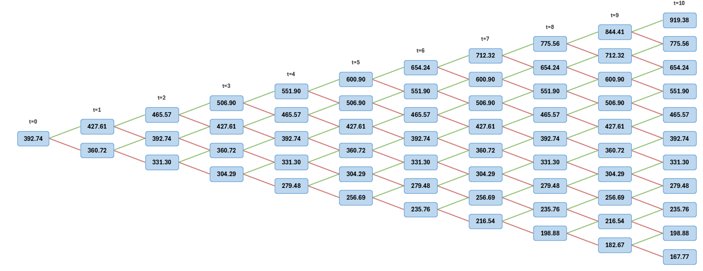

```{=latex}
\newpage
```

```{=html}
<h1>Information</h1>

This R Markdown document was created as part of a group assignment for SMM068 at Bayes Business School, City St George's, University of London in Term 2 2025-26.

```

```{r asthetic-header, include=FALSE, echo=FALSE}
# ============================================================================ #
# Key Information ====
# SMM068 Financial Economics (Subject CM2)
# Group Coursework 2025-26
# Group:        Group 08
# Authors (in alphabetical order):
#   - Benjamin Evans
#   - Basmah Khan
#   - Bong Su Kil
#   - Ardi Wira Sudarmo
# Professor:    Professor Ioannis Kyriakou
# Institution:  Bayes Business School - City St George's, University of London
# Date:         30 Mar 2026
#
# Description:  Term 2 group project for SMM068 Financial Economics
#               (50% of coursework grade - 10% of module grade). The R code
#               below has been exported directly from an R Markdown (.rmd) file.
#               Hence the knitr settings.
#
# Dependencies:
#   - quantmod: for downloading
#   - tidyverse: loads dplyr, tidyr, ggplot2, purrr (& others)
#   - TBI: loads dplyr, tidyr, ggplot2, purrr (& others)
#
# Acknowledgements
#   - Bodie et al., 2024, chapters 5-8 were used as a primary source for the
#     concepts coded here (in addition to the lecture notes)
# ============================================================================ #
```

```{r setup-knitr, include=FALSE, echo=FALSE}
# Setup & configuration ====
#----------------------- Initial setup (knitr settings) -----------------------#
dir.create("fig", showWarnings = FALSE)

# Defaults common to all outputs
knitr::opts_chunk$set(
  echo     = TRUE,
  message  = FALSE,
  warning  = FALSE,
  fig.align = "center",
  out.width = "100%",
  fig.path  = "fig/",
  dpi       = 300
)

# Output-specific settings
if (knitr::is_latex_output()) {
  knitr::opts_chunk$set(
    fig.width = 6,
    fig.height = 4,
    dev = "pdf",
    fig.pos = "!ht",
    out.extra = ""
  )
} else {
  knitr::opts_chunk$set(
    fig.width = 6,
    fig.height = 4,
    dev = "svglite"  # or "png"
  )
}
```

```{r setup-qol, include=FALSE, echo=FALSE}
#----------------------------- Clean environment ------------------------------#
rm(list = ls()) # Remove all objects
graphics.off() # Close all graphical devices
cat("\014") # Clean console
```

```{r load-dependencies, include=FALSE, echo=FALSE}
#------------------- Load dependencies / external libraries -------------------#
# --- Data Fetching ---
# TBI

# --- Data Manipulation & Plotting ---
library(tidyverse) # loads dplyr, tidyr, ggplot2, purrr (& others)
library(patchwork) # for combining multiple plots into one figure

# --- Reporting & Tables ---
library(kableExtra) # for general tables
library(DT) # for HTML interactive data tables
library(plotly) # for interactive html plots
library(pander) # for writing to pandoc
```

```{r html-app, echo=FALSE, results='asis', eval=knitr::is_html_output(), purl=FALSE}
#------------------------------ HTML link to app ------------------------------#
library(htmltools)

div(style = "background-color: #f8f9fa; padding: 20px; border: 1px solid #e9ecef; border-radius: 5px; text-align: center; margin-bottom: 30px;",
  h3("Bonus Interactive Dashboard Available"),
  p("!!TBI."),
  a(href = "https://3enji.shinyapps.io/smm068-a01-g08-dashboard/",
    target = "_blank",
    class = "btn btn-primary",
    style = "background-color: #007bff; color: white; padding: 10px 20px; text-decoration: none; border-radius: 5px; font-weight: bold;",
    "Launch Interactive Dashboard")
)
```

```{r custom-functions, include=FALSE, echo=FALSE}
#---------------------------- Custom QOL functions ----------------------------#
#####################################
# function: banner comments (used to to section up code)
# Usage: banner_comment("Element 1: data cleaning") -> then ctrl + v (or cmd+v)
#####################################
banner_comment <- function(text, width = 80, border = "#", fill = "-") {
  txt <- paste0(" ", text, " ")
  inner_width <- width - 2 * nchar(border)
  banner_string <- ""

  if (inner_width <= nchar(txt)) {
    banner_string <- paste0(border, txt, border)
  } else {
    pad_total <- inner_width - nchar(txt)
    pad_left <- pad_total %/% 2
    pad_right <- pad_total - pad_left

    banner_string <- paste0(
      border,
      strrep(fill, pad_left),
      txt,
      strrep(fill, pad_right),
      border
    )
  }

  cat(banner_string, "\n")
  # copy banner to allow direct pasting (requires clipr)
  clipr::write_clip(banner_string)
  # avoid [1] when printing if want to manually copy
  invisible(banner_string)
}
#####################################
# function: format p-values for text
# Usage (in-line): `r format_p_vals(ad_test_result$p.value)`
# Usage (console): format_p_vals(ad_test_result$p.value)
#####################################
format_p_vals <- function(p) {
  if (length(p) != 1L || is.na(p)) {
    stop("Error! p must be a single non-missing value")
  }
  if (p > 1) {
    stop("Error! Value greater than 1")
  }
  if (p < 0) {
    stop("Error! Value less than 0")
  }

  if (p >= 0.01) {
    paste0("= ", formatC(p, format = "f", digits = 2))
  } else if (p >= 0.001) {
    paste0("= ", formatC(p, format = "f", digits = 3))
  } else {
    "< 0.001"
  }
}
#####################################
# function: format confidence intervals for tables & text
# Usage (in-line): `r format_interval(el2_ci_normal_95[1], el2_ci_normal_95[2])`
# Usage (console): format_interval(el2_ci_normal_95[1], el2_ci_normal_95[2])
#####################################
format_interval <- function(lower, upper, digits = 3, small_interval = 5L) {
  paste0(
    "[",
    formatC(
      lower,
      format = "f",
      digits = digits,
      small.interval = small_interval,
      small.mark = " "
    ),
    ", ",
    formatC(
      upper,
      format = "f",
      digits = digits,
      small.interval = small_interval,
      small.mark = " "
    ),
    "]"
  )
}
#####################################
# function: format truncated ellipses
# Usage (in-line): `r tbi`
# Usage (console): tbi
#####################################
fmt_trunc_ellip <- function(
  x,
  digits = 7,
  ellip = "...",
  tol = 1e-12,
  trim_zeros_if_exact = TRUE
) {
  out <- rep(NA_character_, length(x))
  ok <- is.finite(x)
  scale <- 10^digits
  xt <- trunc(x[ok] * scale) / scale
  s <- formatC(xt, format = "f", digits = digits)
  add <- abs(x[ok] - xt) > tol * pmax(1, abs(x[ok]))
  if (trim_zeros_if_exact) {
    s_trim <- sub("0+$", "", s) # drop trailing zeros
    s_trim <- sub("\\.$", "", s_trim) # drop trailing decimal point
  } else {
    s_trim <- s
  }
  out[ok] <- ifelse(add, paste0(s, ellip), s_trim)
  out[is.na(x)] <- NA_character_
  out
}
#####################################
# function: function to format 6dp numbers with a space after the 3rd decimal
# digit
# Usage (in-line): TBI
# Usage (console): TBI
#####################################
format_spaced_6dp <- function(x) {
  # Format to 6 decimal places
  s <- sprintf("%.6f", x)
  # Insert space between the first 3 and last 3 decimal digits
  sub("(\\.[0-9]{3})([0-9]{3})$", "\\1 \\2", s)
}
```

# Binomial tree {#qone}

To calibrate a one-year binomial tree model for the stock price, the historical
daily closing prices over the last ten years were accessed using the Excel
`STOCKHISTORY` funciton. Microsoft Corporation (`MSFT`) stock was used with 10 years of daily observations,
from 1 March 2016 to 27 February 2026. The daily log-return series was
calculated using

$$
r_{t} = \ln\left(\dfrac{S_t}{S_{t-1}}\right)
$$

From the historical log-returns, the empirical daily variance was estimated as 
$$
\widehat{\text{Var}}(r_t) = 0.00028707\ldots
$$

with a corresponding daily and annual standard deviation (volatility), assuming
252 trading days per year, was
$$
\begin{aligned}
\hat{\sigma}_{\text{daily}} &= 0.01694332\ldots \\
\hat{\sigma}_{\text{annual}} &= \hat{\sigma}_{\text{daily}} \sqrt{252} \\ &= 0.26896700\ldots \\
\end{aligned}
$$

A one-year binomial tree with 10-time steps was then assumed, so that 
$$
T = 1, \quad N = 10, \quad \Delta t = \frac{T}{N} = 0.1
$$

Using the Cox–Ross–Rubinstein (CRR) specification, the up and down factors are defined by 
$$
u = e^{\sigma \sqrt{\Delta t}}, \quad d = 1/u
$$
$$
\begin{aligned}
\rightarrow u &= e^{(0.268967\ldots)\times \sqrt{0.1} } &= 1.088776\ldots \\
\rightarrow d &= \frac{1}{1.088776\ldots} &= 0.918461\ldots\\
\end{aligned}
$$

The calibrated binomial model parameters (rounded to 5 decimal places) are: 

<!-- prettier-ignore -->
::: {.answer-wrapper} 
::: {.answer} 
$u=1.08878, \quad d=0.91846$
::: 
:::

These values imply that at each step of the binomial tree, the stock price either increases by a factor of approximately 1.08878 or decreases by a factor of approximately 0.91846. 

For completeness, using the continuously compounded risk-free rate $r= 0.038$ as given in \@ref(qthr), the risk-neutral probability is 

$$
q 
= \frac{e^{r\Delta t} - d}{u - d} 
= \frac{e^{0.038 \times 0.1} - (0.91846\ldots)}{(1.08878\ldots) - (0.91846\ldots)} 
= 0.5011\ldots 
$$

Although the main requirement in this part is to estimate $u$ and $d$, this probability is useful for the construction of the binomial tree in \@ref(qtwo). 


# Binomial tree figure {#qtwo}

Using the calibrated parameters obtained in \@ref(qone), a binomial stock price tree was constructed using a discrete-time framework. The initial stock price was taken as the most recent observed value in the dataset ($S_0 = 392.74\$$ on 27 February 2026).  The binomial tree was generated over a one-year horizon with ten discrete time steps. At each step, the stock price evolves according to the CRR model, where the price either moves up by a factor $u$ or down by a factor $d$. The stock price at each node is given by:

$$
S(t,j) = S_{0} \cdot u^{j} \cdot d^{t-j}
$$

where $t$ denotes the time step and $j$ represents the number of upward movements.

The tree was implemented in Excel using a VBA procedure to systematically generate all node values and visually represent the structure (described in more detail in \S(appendix-A)). Each node corresponds to a possible future stock price, and the branching structure reflects all potential price paths over the entire time horizon. The resulting tree, shown in Figure \@ref(fig:q2-binomial-tree), illustrates how the stock price evolves over time under the binomial model, showing the recombining structure and the corresponding stock prices at each node.  The tree is recombining, meaning that different paths can lead to the same node.  The first-step node values are calculated as follows, 

The tree was implemented in Excel using a VBA procedure to systematically generate all node values and visually represent the structure. Each node corresponds to a possible future stock price, and the branching structure reflects all potential price paths over the entire time horizon. The resulting tree clearly illustrates how the stock price evolves over time under the binomial model.  The tree is recombining, meaning that different paths can lead to the same node. An illustration of the binomial tree is provided below, showing the recombining structure and the corresponding stock prices at each node.

$$
S_{0} = 392.74, \quad u = 1.08878\ldots, \quad d = 0.91846\ldots
$$

The first-step node values are calculated as follows:
$$
\begin{aligned}
S(1,1) &= S_{0} \cdot u &= 392.74 \times 1.08878\ldots &= 427.61 \\
S(1,0) &= S_{0} \cdot d &= 392.74 \times 0.91846\ldots &= 360.72 
\end{aligned}
$$
The second-step node values are given by:
$$
\begin{aligned}
S(2,2) &= S_{0} \cdot u^{2} &= 392.74 \times (1.08878\ldots)^{2} &= 465.57 \\
S(2,1) &= S_{0} \cdot u \cdot d &= 392.74 \times 1.08878\ldots \times 0.91846\ldots &= 392.74 \\
S(2,0) &= S_{0} \cdot d^{2} &= 392.74 \times (0.91846\ldots)^{2} &= 331.30 \\
\end{aligned}
$$
The remaining nodes are computed in the same way.

Created using Excel... (& VBA). See \S\@ref(app:excel-impl) for more information.

```{r q2-binomial-tree, echo=FALSE, purl=FALSE, out.width="100%", fig.cap="Binomial stock price tree over a one-year horizon with ten-time steps constructed using the Cox–Ross–Rubinstein model."}

```

```{=latex}
\newpage
```

# European vanilla put option {#qthr}

# Bermudan put option {#qfou}

The Bermudan put has the same parameters as the European put but permits early exercise at each of the 10 tree dates. 

At every node the holder takes the greater of exercising (intrinsic value K-S) or continuing:

Option 1 (formatting):
$$
V_{\text{berm}}(i,j) = \max \left( K - S(i,j),\; e^{-r \Delta t} \left[ q V(i+1, j+1) + (1 - q)V(i+1, j) \right] \right)
$$

Option 2:
$$
V_{\text{berm}}(i,j) = \max \begin{cases}
K-S(i,j), \\
e^{-r \Delta t} \bigg[ q \cdot V(i+1, j+1) + (1 - q)\cdot V(i+1, j) \bigg]
\end{cases}
$$

Note: Put so price increases the more underlying stock decreases…

```{r q-fou-calc, eval=TRUE, echo=TRUE, message=FALSE, warning=FALSE, attr.source='.numberLines'}

## Q1 calibration (from Excel) ----
S0 <- 392.74
sigma <- 0.269077702
T_mat <- 1
N <- 10
dt <- T_mat / N

## CRR up/down factors ----
u <- exp(sigma * sqrt(dt))
d <- 1 / u

## Risk-neutral pricing inputs (Q3 specification) ----
r <- 0.038
K <- 1.05 * S0
q <- (exp(r * dt) - d) / (u - d)
disc <- exp(-r * dt)


# Q2: Stock Price Tree ====

## Pre-allocate (N+1) x (N+1) matrix ----
S <- matrix(0, N + 1, N + 1)

## Forward induction: S[j+1, i+1] = S0 * u^j * d^(i-j) ----
for (i in 0:N) {
  for (j in 0:i) {
    S[j + 1, i + 1] <- S0 * u^j * d^(i - j)
  }
}


# Q3: European Put ====

## Initialise option value matrix ----
V_eu <- matrix(0, N + 1, N + 1)

## Terminal payoff: max(K - S, 0) ----
for (j in 0:N) {
  V_eu[j + 1, N + 1] <- max(K - S[j + 1, N + 1], 0)
}

## Backward induction: discounted risk-neutral expectation ----
for (i in (N - 1):0) {
  for (j in 0:i) {
    V_eu[j + 1, i + 1] <- disc *
      (q * V_eu[j + 2, i + 2] + (1 - q) * V_eu[j + 1, i + 2])
  }
}


# Q4: Bermudan Put ====

## Initialise option value and early exercise matrices ----
V_bm <- matrix(0, N + 1, N + 1)
early <- matrix(FALSE, N + 1, N + 1)

## Terminal payoff (identical to European) ----
for (j in 0:N) {
  V_bm[j + 1, N + 1] <- max(K - S[j + 1, N + 1], 0)
}

## Backward induction: max(intrinsic, continuation) ----
for (i in (N - 1):0) {
  for (j in 0:i) {
    ### Continuation value: hold the option ----
    cont <- disc * (q * V_bm[j + 2, i + 2] + (1 - q) * V_bm[j + 1, i + 2])
    ### Intrinsic value: exercise now ----
    exer <- K - S[j + 1, i + 1]
    ### Take the maximum; flag early exercise nodes ----
    V_bm[j + 1, i + 1] <- max(cont, exer)
    early[j + 1, i + 1] <- (exer > cont) & (exer > 0)
  }
}


# Results ====
# cat(sprintf("European put price:     %.4f\n", V_eu[1, 1]))
# cat(sprintf("Bermudan put price:     %.4f\n", V_bm[1, 1]))
# cat(sprintf("Early exercise premium: %.4f\n", V_bm[1, 1] - V_eu[1, 1]))
```

Will wait for Ardi, but got these values:

- European put price (4dp):     `r formatC(V_eu[1, 1], format = "f", digits = 4)`
- Bermudan put price (4dp):     `r formatC(V_bm[1, 1], format = "f", digits = 4)`
- Early exercise premium (4dp): `r formatC(V_bm[1, 1] - V_eu[1, 1], format = "f", digits = 4)`


```{r q-fou-tree, eval=TRUE, echo=FALSE, fig.width=7, fig.height=6.0, fig.cap="Figure showing something.", fig.pos='!ht', message=FALSE, warning=FALSE}
# Tree Plotting ====
## Reusable plot function ----
plot_tree <- function(V, S, title, show_early = NULL) {
  par(mar = c(4, 4, 3, 1))
  yvals <- S[S > 0]
  plot(
    NULL,
    xlim = c(-0.5, N + 1.2),
    ylim = c(min(yvals) * 0.93, max(yvals) * 1.04),
    xlab = "Time step (i)",
    ylab = "Stock price ($)",
    main = title
  )

  for (i in 0:N) {
    for (j in 0:i) {
      price <- S[j + 1, i + 1]
      val <- V[j + 1, i + 1]

      ### Draw edges to next time step ----
      if (i < N) {
        lines(c(i, i + 1), c(price, S[j + 2, i + 2]), col = "grey70", lwd = 0.6)
        lines(c(i, i + 1), c(price, S[j + 1, i + 2]), col = "grey70", lwd = 0.6)
      }

      ### Node colour: red = exercise, navy = positive, grey = zero ----
      if (!is.null(show_early) && show_early[j + 1, i + 1]) {
        col <- "red"
        cex_pt <- 1.2
      } else if (val > 0) {
        col <- "navy"
        cex_pt <- 0.8
      } else {
        col <- "grey50"
        cex_pt <- 0.5
      }
      points(i, price, pch = 16, cex = cex_pt, col = col)

      ### Node label ----
      lbl <- sprintf("%.2f", val)
      if (!is.null(show_early) && show_early[j + 1, i + 1]) {
        lbl <- paste0(lbl, " (E)")
      }
      text(
        i,
        price,
        lbl,
        cex = 0.42,
        pos = 3,
        offset = 0.35,
        col = if (!is.null(show_early) && show_early[j + 1, i + 1]) {
          "red"
        } else {
          "black"
        }
      )
    }
  }

  ### Legend (Bermudan only) ----
  if (!is.null(show_early)) {
    legend(
      "topleft",
      legend = c("Early exercise (E)", "Continuation", "Zero"),
      col = c("red", "navy", "grey50"),
      pch = 16,
      pt.cex = c(1.2, 0.8, 0.5),
      cex = 0.7,
      bg = "white"
    )
  }
}


## Q4 plot: Bermudan put tree ----
plot_tree(
  V_bm,
  S,
  sprintf(
    "Q4: Bermudan Put Price Tree (K=%.2f, r=%.1f%%)  |  V0 = %.4f",
    K,
    r * 100,
    V_bm[1, 1]
  ),
  show_early = early
)

```

```{=latex}
\newpage
```

# Commenting on the relative prices of {#qfiv}

# Explain how Bermudan option would change with... {#qsix}

```{=latex}
\newpage
```

<!-- # Conclusions

TBI -->

<!-- ```{=html} -->
<!-- # References -->
<!-- <div id="refs"></div> -->
<!-- ``` -->

<!-- ```{=latex} -->
<!-- \bibliography{references.bib} -->
<!-- ``` -->

```{=latex}
\newpage
\section*{Appendices}
\addcontentsline{toc}{section}{Appendices}

% --- restore default section numbering in the appendix ---
\renewcommand{\thesection}{\arabic{section}}
\renewcommand{\thesubsection}{\thesection.\arabic{subsection}}
\renewcommand{\thesubsubsection}{\thesubsection.\arabic{subsubsection}}
```

# (APPENDIX) Appendices {-}

# Supplemental methodology {#apd-supplementary-methods}

## Spreadsheet implementation (Excel) {#app:excel-impl}

This subsection outlines the structure of the accompanying Excel workbook, using
screenshots to demonstrate the layout and contents of each sheet.

The Binomial Tree figure described in \@ref(qtwo) was implemented using VBA


... TBI

<!-- [^utility-theory]: -->
<!--     Described in more detail in the appendix (\S\@ref(apd-utility-theory)). -->

<!-- [^utility-skew]: -->
<!--     This is demonstrated in the appendix (\S\@ref(apd-utility-theory) and Table -->
<!--     \@ref(tab:exact-utility-table)) where we show that a constant relative risk -->
<!--     aversion (CRRA) utility function with $\gamma > 0$ mathematically confirms -->
<!--     that for risk-averse investors asset 1 results in a lower expected utility -->
<!--     that asset 2. --> -->
